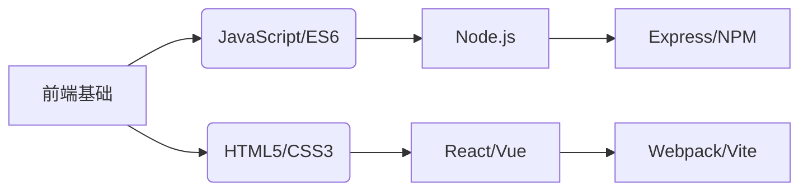

<!-- 动态标题（增强视觉吸引力） -->
<h1 align="center">
  
</h1>

  
  
  
  

---

<!-- 核心自我介绍段落 -->

  <strong>一名热爱技术的全栈探索者</strong>，专注于通过代码构建智能且优雅的解决方案。
  我的技术旅程始于前端开发，逐渐深入Node.js后端架构与AI应用开发领域。目前致力于探索：

<!-- 兴趣领域分点展示 -->

- 🔹 前端工程化与用户体验优化 
- 🔹 Node.js高性能服务与工具链开发 
- 🔹 Python在机器学习与自动化中的应用 
- 🔹 开源社区协作与知识共享

### 📚 学习轨迹

### 💡 ​**技术信仰**  
> 坚信"代码即设计"，追求简洁优雅的实现方案  
> 倡导"Learn by Sharing"，持续参与开源文档翻译与技术博客写作  
> 践行"Automate Everything"，用脚本提升开发效率
